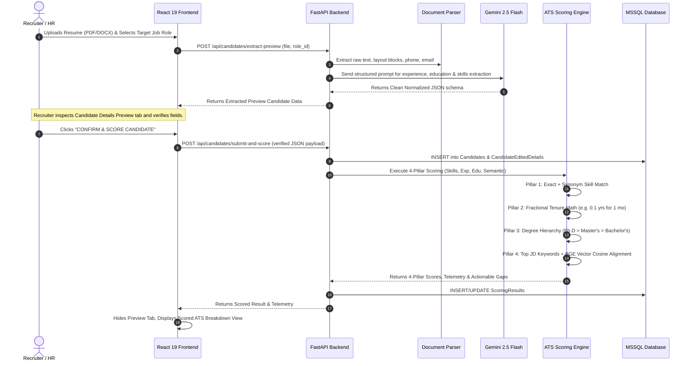

# 🏗️ System Architecture & Engineering Blueprint

This document details the architectural principles, component relationships, data flow pipelines, and technology stack powering the Enterprise ATS.

---

## 1. High-Level Architecture Overview

The system follows a modern decoupled client-server architecture with an asynchronous AI pipeline and a high-performance relational/vector data store.

```mermaid
flowchart TD
    subgraph ClientLayer ["🖥️ Frontend Client Layer (React 19 + Vite)"]
        UI_Dashboard["Dashboard / Leaderboard"]
        UI_Upload["Resume Upload & Dropzone"]
        UI_Preview["Candidate Details Preview Tab"]
        UI_ScoreView["4-Pillar ATS Breakdown View"]
        UI_WeightsModal["Dynamic Weights Tuner"]
    end

    subgraph APILayer ["⚡ Backend Application Layer (FastAPI)"]
        API_Main["FastAPI Gateway (main.py)"]
        Router_Candidates["Candidate Routes (/api/candidates)"]
        Router_Roles["Role Routes (/api/roles)"]
        Router_Settings["Settings Routes (/api/settings)"]
    end

    subgraph CoreServices ["🧠 Intelligence & Computation Engines"]
        DocParser["Deterministic Document Parser (PyPDF2 / docx)"]
        AIParser["Gemini 2.5 Flash Targeted Parser (ai_parser.py)"]
        ScoringEngine["4-Pillar Scoring Engine (scoring.py)"]
        EmbeddingEngine["Neural Embedding & Cosine Similarity"]
    end

    subgraph DataLayer ["💾 Persistence Layer (Microsoft SQL Server)"]
        DB_ATSSystem[("ATSSystem Database")]
        T_Roles["JobRoles / JobDescriptions"]
        T_Skills["Skills / RoleSkills"]
        T_Candidates["Candidates / CandidateEditedDetails"]
        T_Scores["ScoringResults"]
        T_Embeddings["JDEmbeddings / CandidateEmbeddings"]
    end

    subgraph ExternalServices ["🌐 External Cloud Providers"]
        OpenRouter["OpenRouter API (google/gemini-2.5-flash)"]
    end

    %% Client to API
    UI_Upload -->|POST /api/candidates/extract-preview| Router_Candidates
    UI_Preview -->|POST /api/candidates/submit-and-score| Router_Candidates
    UI_Dashboard -->|GET /api/candidates/role/{id}| Router_Candidates
    UI_ScoreView -->|GET /api/candidates/{id}| Router_Candidates
    UI_WeightsModal -->|POST /api/settings/scoring-weights| Router_Settings

    %% API to Services
    Router_Candidates --> DocParser
    Router_Candidates --> AIParser
    Router_Candidates --> ScoringEngine
    Router_Settings --> ScoringEngine
    ScoringEngine --> EmbeddingEngine

    %% Services to External
    AIParser -->|Async HTTP REST| OpenRouter
    EmbeddingEngine -->|Async Embeddings| OpenRouter

    %% Services to Database
    Router_Candidates <--> DB_ATSSystem
    Router_Roles <--> DB_ATSSystem
    Router_Settings <--> DB_ATSSystem
    ScoringEngine <--> DB_ATSSystem
```

---

## 2. End-to-End Ingestion & Scoring Workflow

The workflow is split into two explicit phases: **Extraction & Preview** and **Verification & 4-Pillar Scoring**.



---

## 3. Technology Stack & Architectural Roles

| Component | Technology | Version | Purpose |
| :--- | :--- | :--- | :--- |
| **Backend Framework** | FastAPI | `^0.109.0` | Asynchronous high-speed REST API gateway, dependency injection, and automatic OpenAPI generation. |
| **ASGI Web Server** | Uvicorn | `^0.27.0` | Production ASGI web server for concurrent async request handling. |
| **Document Parsing** | PyPDF2, python-docx | `3.0.1 / 1.1.0` | Deterministic local layout, text, and metadata extraction without network dependencies. |
| **LLM Provider** | OpenRouter API | Cloud | Exclusive enterprise gateway to `google/gemini-2.5-flash` for deterministic schema extraction. |
| **Relational Database** | Microsoft SQL Server | 2019 / 2022 / Azure | Enterprise ACID storage for candidate records, role definitions, and scoring telemetry. |
| **Database Driver** | pyodbc + ODBC Driver 18 | `^5.1.0` | High-throughput native ODBC pooling for Windows Authentication and SQL credentials. |
| **Vector Similarity** | NumPy | `^1.26.3` | High-performance vector dot-product and cosine similarity math. |
| **Frontend Framework** | React | `^19.2.8` | Component-based reactive UI rendering, responsive state management. |
| **Build & Bundler** | Vite | `^6.2.0` | Sub-second HMR development server and optimized production rollup bundler. |
| **HTTP Client** | Axios | `^1.19.0` | REST communication with retry interceptors and multipart upload streaming. |
| **UI Design System** | Neo-Brutalism | Custom CSS | High-contrast, accessibility-focused enterprise dashboard with black borders, solid shadows, and clear visual hierarchy. |

---

## 4. Key Design Patterns & Principles

1. **Deterministic Fallback First**:
   - The parser utilizes deterministic local regex and layout extraction first. If the LLM call encounters timeouts or network errors, the deterministic fallback seamlessly extracts emails, phones, skills, and text without crashing.

2. **Zero-LLM Recalculation**:
   - When tuning scoring weights (e.g. changing Skills from 40% to 35% and Experience from 30% to 35%), the system recalculates overall scores mathematically using stored candidate metadata and vector caches, executing in `< 5ms` per candidate with **$0 API cost**.

3. **Self-Healing Infrastructure**:
   - On server startup, `db.init_database()` connects to MSSQL `master`, verifies the target database, creates all missing tables, applies schema migrations, drops deprecated columns, and seeds initial roles and skills.

4. **Dedicated Dual-Table Vector Embeddings**:
   - JD embeddings and Candidate embeddings are stored in distinct database tables (`JDEmbeddings` and `CandidateEmbeddings`), preventing indexing collisions and allowing targeted cosine similarity scans.

