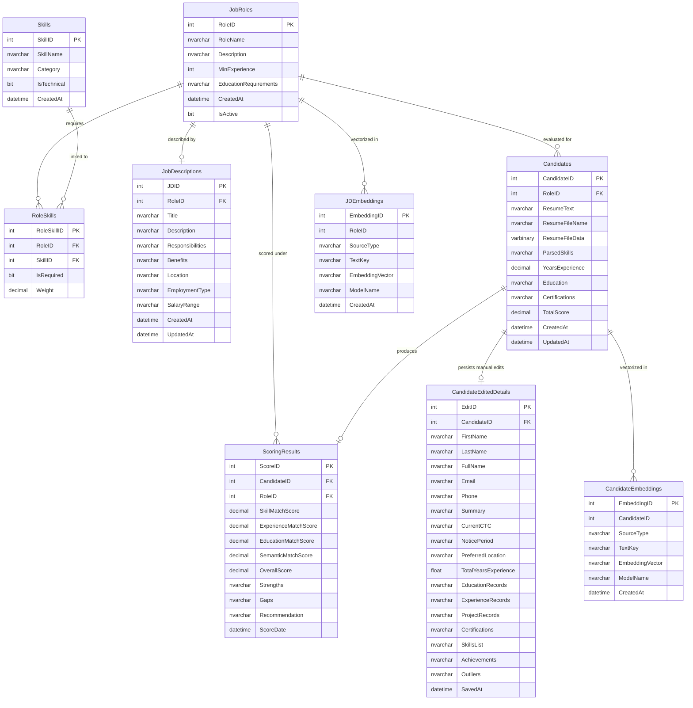

# 💾 Database Schema, Models & Data Dictionary

This document details the relational data model, database tables, indexing strategies, vector embedding storage, and auto-initialization mechanisms in Microsoft SQL Server.

---

## 1. Entity-Relationship Diagram (ERD)

---

## 2. Table-by-Table Data Dictionary

### 2.1 `JobRoles`
Stores open positions and job titles configured in the ATS.

| Column | Type | Constraints | Description |
| :--- | :--- | :--- | :--- |
| `RoleID` | `INT` | `IDENTITY(1,1) PRIMARY KEY` | Unique role identifier. |
| `RoleName` | `NVARCHAR(100)` | `NOT NULL UNIQUE` | Title of the position (e.g., "Data Analyst", "Data Scientist"). |
| `Description` | `NVARCHAR(1000)` | `NULL` | High-level summary of the role. |
| `MinExperience` | `INT` | `DEFAULT 0` | Minimum required experience in years (used for Pillar 2 scoring). |
| `EducationRequirements` | `NVARCHAR(500)` | `NULL` | Required qualification (e.g., "Bachelor in Statistics", "Master in Data Science"). |
| `CreatedAt` | `DATETIME` | `DEFAULT GETDATE()` | Timestamp when the role was created. |
| `IsActive` | `BIT` | `DEFAULT 1` | Status flag indicating if the role is currently open for hiring. |

---

### 2.2 `Skills`
Master catalog of technical, functional, and domain skills.

| Column | Type | Constraints | Description |
| :--- | :--- | :--- | :--- |
| `SkillID` | `INT` | `IDENTITY(1,1) PRIMARY KEY` | Unique skill identifier. |
| `SkillName` | `NVARCHAR(100)` | `NOT NULL UNIQUE` | Standardized skill name (e.g., "Python", "SQL", "Pandas", "React"). |
| `Category` | `NVARCHAR(50)` | `NULL` | Categorization (e.g., "Programming", "AI/ML", "Database", "Cloud"). |
| `IsTechnical` | `BIT` | `DEFAULT 1` | `1` for technical capabilities, `0` for soft/domain skills. |
| `CreatedAt` | `DATETIME` | `DEFAULT GETDATE()` | Timestamp of addition. |

---

### 2.3 `RoleSkills`
Many-to-many relationship mapping skills to specific job roles with weights.

| Column | Type | Constraints | Description |
| :--- | :--- | :--- | :--- |
| `RoleSkillID` | `INT` | `IDENTITY(1,1) PRIMARY KEY` | Unique mapping identifier. |
| `RoleID` | `INT` | `FOREIGN KEY -> JobRoles(RoleID) ON DELETE CASCADE` | Assigned role. |
| `SkillID` | `INT` | `FOREIGN KEY -> Skills(SkillID) ON DELETE CASCADE` | Assigned skill. |
| `IsRequired` | `BIT` | `DEFAULT 1` | `1` for Mandatory/Must-Have skills, `0` for Preferred/Nice-to-Have. |
| `Weight` | `DECIMAL(5,2)` | `DEFAULT 1.0` | Relative importance factor (default 1.0). |

* **Unique Constraint**: `UQ_RoleSkills UNIQUE(RoleID, SkillID)`

---

### 2.4 `JobDescriptions`
Detailed job postings, expectations, and domain requirements.

| Column | Type | Constraints | Description |
| :--- | :--- | :--- | :--- |
| `JDID` | `INT` | `IDENTITY(1,1) PRIMARY KEY` | Unique JD identifier. |
| `RoleID` | `INT` | `FOREIGN KEY -> JobRoles(RoleID) ON DELETE CASCADE` | Linked position. |
| `Title` | `NVARCHAR(200)` | `NULL` | Public job posting title. |
| `Description` | `NVARCHAR(MAX)` | `NULL` | Full text job overview. |
| `Responsibilities` | `NVARCHAR(MAX)` | `NULL` | Core duties, tasks, and daily deliverables. |
| `Benefits` | `NVARCHAR(MAX)` | `NULL` | Compensation, perks, and benefits. |
| `Location` | `NVARCHAR(200)` | `NULL` | Location / Remote status. |
| `EmploymentType` | `NVARCHAR(50)` | `NULL` | Full-time, Part-time, Contract, Internship. |
| `SalaryRange` | `NVARCHAR(100)` | `NULL` | Compensation band. |
| `CreatedAt` | `DATETIME` | `DEFAULT GETDATE()` | Creation timestamp. |
| `UpdatedAt` | `DATETIME` | `DEFAULT GETDATE()` | Last updated timestamp. |

---

### 2.5 `Candidates`
Core record for every parsed and uploaded resume.

| Column | Type | Constraints | Description |
| :--- | :--- | :--- | :--- |
| `CandidateID` | `INT` | `IDENTITY(1,1) PRIMARY KEY` | Unique candidate identifier. |
| `RoleID` | `INT` | `FOREIGN KEY -> JobRoles(RoleID)` | Target role applied for. |
| `ResumeText` | `NVARCHAR(MAX)` | `NULL` | Clean, extracted plain text from the resume document. |
| `ResumeFileName` | `NVARCHAR(255)` | `NULL` | Original uploaded document filename. |
| `ResumeFileData` | `VARBINARY(MAX)` | `NULL` | Optional binary byte store for document archiving. |
| `ParsedSkills` | `NVARCHAR(MAX)` | `NULL` | JSON array of extracted technical and soft skills. |
| `YearsExperience` | `DECIMAL(5,2)` | `DEFAULT 0` | Total calculated experience tenure in decimal years. |
| `Education` | `NVARCHAR(MAX)` | `NULL` | JSON array or formatted string of education degrees. |
| `Certifications` | `NVARCHAR(MAX)` | `NULL` | Comprehensive structured JSON metadata (contact, projects, history). |
| `TotalScore` | `DECIMAL(5,2)` | `DEFAULT 0` | Overall 4-pillar ATS score (0-100%). |
| `CreatedAt` | `DATETIME` | `DEFAULT GETDATE()` | Ingestion timestamp. |
| `UpdatedAt` | `DATETIME` | `DEFAULT GETDATE()` | Last scoring/update timestamp. |

---

### 2.6 `CandidateEditedDetails`
Dedicated storage for manually verified, enriched, or edited candidate profile fields.

| Column | Type | Constraints | Description |
| :--- | :--- | :--- | :--- |
| `EditID` | `INT` | `IDENTITY(1,1) PRIMARY KEY` | Unique edit record identifier. |
| `CandidateID` | `INT` | `UNIQUE NOT NULL FOREIGN KEY -> Candidates(CandidateID) ON DELETE CASCADE` | Associated candidate. |
| `FirstName` | `NVARCHAR(150)` | `NULL` | Verified candidate first name. |
| `LastName` | `NVARCHAR(150)` | `NULL` | Verified candidate last name. |
| `FullName` | `NVARCHAR(250)` | `NULL` | Full display name. |
| `Email` | `NVARCHAR(250)` | `NULL` | Verified email address. |
| `Phone` | `NVARCHAR(50)` | `NULL` | Verified phone number. |
| `Summary` | `NVARCHAR(MAX)` | `NULL` | Professional bio and summary highlights. |
| `CurrentCTC` | `NVARCHAR(100)` | `NULL` | Current compensation. |
| `NoticePeriod` | `NVARCHAR(100)` | `NULL` | Availability / notice duration. |
| `PreferredLocation`| `NVARCHAR(150)` | `NULL` | Desired relocation or workplace location. |
| `TotalYearsExperience` | `FLOAT` | `NULL` | User-confirmed years of experience. |
| `EducationRecords` | `NVARCHAR(MAX)` | `NULL` | Verified JSON array of structured education entries. |
| `ExperienceRecords`| `NVARCHAR(MAX)` | `NULL` | Verified JSON array of employment records. |
| `ProjectRecords` | `NVARCHAR(MAX)` | `NULL` | Verified JSON array of academic/independent projects. |
| `Certifications` | `NVARCHAR(MAX)` | `NULL` | Verified JSON array of professional certifications. |
| `SkillsList` | `NVARCHAR(MAX)` | `NULL` | Verified JSON array of skills. |
| `Achievements` | `NVARCHAR(MAX)` | `NULL` | Verified honors, publications, or achievements. |
| `Outliers` | `NVARCHAR(MAX)` | `NULL` | Additional sections or miscellaneous details. |
| `SavedAt` | `DATETIME` | `DEFAULT GETDATE()` | Timestamp of last profile edit. |

---

### 2.7 `ScoringResults`
Persistent breakdown of the 4-Pillar scoring evaluation.

| Column | Type | Constraints | Description |
| :--- | :--- | :--- | :--- |
| `ScoreID` | `INT` | `IDENTITY(1,1) PRIMARY KEY` | Unique score record identifier. |
| `CandidateID` | `INT` | `NOT NULL FOREIGN KEY -> Candidates(CandidateID) ON DELETE CASCADE` | Scored candidate. |
| `RoleID` | `INT` | `NOT NULL FOREIGN KEY -> JobRoles(RoleID)` | Job role criteria. |
| `SkillMatchScore` | `DECIMAL(5,2)` | `DEFAULT 0` | Pillar 1: Skills Match Score (0-100%). |
| `ExperienceMatchScore` | `DECIMAL(5,2)` | `DEFAULT 0` | Pillar 2: Experience Tenure Score (0-100%). |
| `EducationMatchScore` | `DECIMAL(5,2)` | `DEFAULT 0` | Pillar 3: Degree Hierarchy Score (0-100%). |
| `SemanticMatchScore` | `DECIMAL(5,2)` | `DEFAULT 0` | Pillar 4: Semantic Vector & Keyword Match (0-100%). |
| `OverallScore` | `DECIMAL(5,2)` | `DEFAULT 0` | Weighted aggregate score (0-100%). |
| `Strengths` | `NVARCHAR(MAX)` | `NULL` | JSON array of actionable recommendations and strengths. |
| `Gaps` | `NVARCHAR(MAX)` | `NULL` | JSON array of missing required skills and keywords. |
| `Recommendation` | `NVARCHAR(50)` | `NULL` | Recommendation category: `Strong Match`, `Consider`, or `Not Recommended`. |
| `ScoreDate` | `DATETIME` | `DEFAULT GETDATE()` | Timestamp when score was computed. |

---

### 2.8 `JDEmbeddings` & `CandidateEmbeddings`
Dedicated vector storage tables for high-dimensional neural representations.

| Column | Type | Constraints | Description |
| :--- | :--- | :--- | :--- |
| `EmbeddingID` | `INT` | `IDENTITY(1,1) PRIMARY KEY` | Unique embedding record identifier. |
| `RoleID` / `CandidateID` | `INT` | `NULL` | Source reference ID. |
| `SourceType` | `NVARCHAR(50)` | `NOT NULL` | Token identifier (`JD_ITEM`, `CANDIDATE_ITEM`). |
| `TextKey` | `NVARCHAR(500)` | `NOT NULL UNIQUE` | Hash or truncated clean string key to prevent duplicates. |
| `EmbeddingVector` | `NVARCHAR(MAX)` | `NOT NULL` | JSON serialized float vector array (e.g. 768-dim float vector). |
| `ModelName` | `NVARCHAR(100)` | `DEFAULT 'baai/bge-base-en-v1.5'` | Embedding model name used for generation. |
| `CreatedAt` | `DATETIME` | `DEFAULT GETDATE()` | Generation timestamp. |

---

## 3. Auto-Initialization & Schema Self-Healing

The database engine in [`backend/database.py`](file:///c:/Users/hijee/Music/demo/ATS%20WITH%20AI%20EXTRACTION/backend/database.py#L107-L380) executes `init_database()` upon FastAPI startup:

1. **Database Existence Check**: Automatically creates database `[ATSSystem]` if not present on the SQL Server instance.
2. **Schema Verification**: Runs `IF NOT EXISTS` DDL statements for all 8 tables.
3. **Legacy Clean-up**: Automatically removes legacy deprecated columns (`PreferredSkillsScore`, `UserID`, etc.) and handles foreign key constraints.
4. **Seed Data Insertion**: If `JobRoles` table is empty, seeds 6 standard enterprise roles (Data Scientist, Full Stack Developer, Product Manager, DevOps Engineer, UX/UI Designer, Data Analyst) and 40+ common technical skills with mapping.

