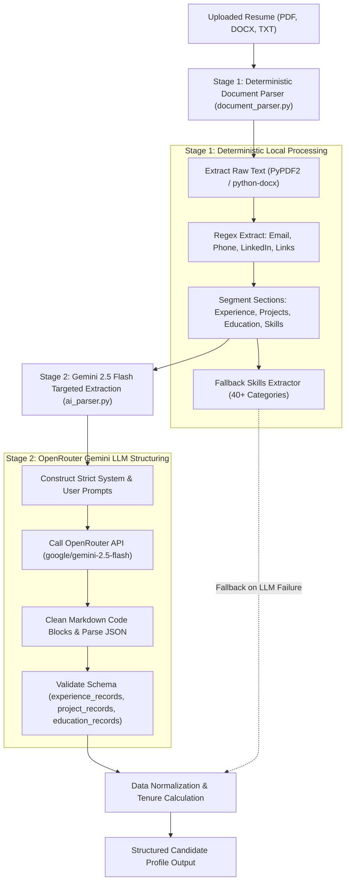
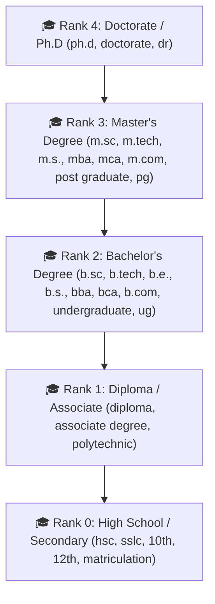

# 🤖 AI Extraction, Resume Ingestion & Parsing Pipeline

This document explains the two-stage document parsing engine, OpenRouter Gemini 2.5 Flash schema extraction, date/tenure computation, and degree hierarchy classification.

---

## 1. Two-Stage Extraction Architecture

The ATS employs a hybrid parsing architecture that guarantees 100% extraction resilience even during internet outages or LLM API rate limits.



---

## 2. Stage 1: Deterministic Document Parser (`document_parser.py`)

1. **Format Handlers**:
   - **PDF**: Uses `PyPDF2.PdfReader` with UTF-8 character fallback and multi-column block preservation.
   - **DOCX**: Uses `python-docx` to iterate through paragraphs, bullet lists, and embedded XML tables.
   - **TXT**: Direct UTF-8 / Latin-1 stream decoding.

2. **Regex Contact Identifiers**:
   - **Email**: `[a-zA-Z0-9_.+-]+@[a-zA-Z0-9-]+\.[a-zA-Z0-9-.]+`
   - **Phone**: Detects international and local formats: `(\+?\d{1,3}[-.\s]?)?\(?\d{3}\)?[-.\s]?\d{3}[-.\s]?\d{4}`

3. **Section Delimiter Detection**:
   - Identifies structural section headings (`WORK EXPERIENCE`, `EMPLOYMENT HISTORY`, `PROJECTS`, `EDUCATION`, `CERTIFICATIONS`, `SKILLS`) using high-confidence boundary tokens.

---

## 3. Stage 2: Gemini 2.5 Flash Targeted Schema Extraction (`ai_parser.py`)

The LLM is provided only the isolated sections (`RAW WORK EXPERIENCE`, `RAW PROJECTS`, `RAW EDUCATION`) to prevent hallucinations and optimize token latency.

### 3.1 Strict LLM Prompt Architecture
```text
System Prompt: "You are an expert Enterprise ATS parser specialized in work experience, project history, and education. Return only valid JSON."

Critical Extraction Directives:
1. Work Experience vs Projects:
   - Any entry at or for a Company / Organization / Employer MUST be placed in "experience_records", NOT "project_records".
   - "project_records" must ONLY contain independent, academic, or personal projects.
2. Projects:
   - When a project title includes tech stacks (e.g., 'Smart Water Pressure System — Flask, ML, Supabase'), preserve the entire line with the tech stack in "title".
   - "organization" must strictly be the project type (e.g., 'Independent Project').
3. Education:
   - Keep degree, course, institute, start/end dates, and scores properly separated.
```

### 3.2 Target Output JSON Schema
```json
{
  "experience_records": [
    {
      "company": "Lakshmi Corporate Services Coimbatore",
      "designation": "Frontend Developer Intern",
      "joining_date": "Dec 2025",
      "relieved_date": "",
      "work_duration": "",
      "employment_type": "Full Time",
      "currently_working": false,
      "bullets": [
        "Developed responsive UI components using React and PrimeReact."
      ]
    }
  ],
  "project_records": [
    {
      "title": "Docsheild — MERN Stack, Blockchain, Web3.js, Smart Contracts, Encryption",
      "organization": "Independent Project",
      "period": "Jul 2025 – Oct 2025",
      "bullets": [
        "Developed a blockchain-powered platform for secure document storage."
      ]
    }
  ],
  "education_records": [
    {
      "level_of_education": "Postgraduate",
      "course": "M.Sc. Data Science",
      "institute": "Thiagarajar College of Engineering Madurai",
      "from_year": "2023",
      "to_year": "2028",
      "score_type": "CGPA",
      "score": "7.50",
      "currently_pursuing": true
    }
  ]
}
```

---

## 4. Experience Tenure Mathematics (`calculate_years_experience`)

Accurate experience calculation is vital to avoid falsely assigning 0% to candidates with short tenures or single-month internships.

### Supported Date Formats & Tenure Rules:
1. **Month-Year Ranges** (`Dec 2023 to May 2024` or `March 2023 - Present`):
   $$\text{Months} = (\text{Year}_{\text{end}} - \text{Year}_{\text{start}}) \times 12 + (\text{Month}_{\text{end}} - \text{Month}_{\text{start}} + 1)$$
   $$\text{Years} = \text{round}\left(\frac{\text{Months}}{12}, 2\right)$$
2. **Numeric Date Ranges** (`06/2023 - 12/2024`):
   Parses `MM/YYYY` to `MM/YYYY` precisely.
3. **Multi-Year Spans** (`2021 - 2024`):
   $$\text{Months} = \max(1, (\text{Year}_{\text{end}} - \text{Year}_{\text{start}})) \times 12$$
4. **Explicit Text Tokens** (`3.5 years`, `6 months`):
   Regex extracts numeric values directly.
5. **Single-Month Tenures / Internships** (`Dec 2025`):
   Assigns nominal $1.0\text{ month} = \frac{1}{12} \approx 0.083\text{ yrs} \rightarrow \mathbf{0.1\text{ years}}$ to prevent zero-tenure rounding.

---

## 5. Degree Hierarchy & Education Normalization

Education entries are matched against a 5-Tier Degree Hierarchy using case-insensitive regex patterns:



### Degree Matching Rules:
- If $\text{Candidate Rank} \ge \text{Required Rank}$: **Score = 1.0 (100% Match)**. (e.g., M.Sc. candidate applying for Bachelor's role gets 100%).
- If $\text{Candidate Rank} = \text{Required Rank} - 1$: **Score = 0.70 (70% Match)**.
- If $\text{Candidate Rank} = 1\text{ (Diploma)}$ and $\text{Required Rank} = 2\text{ (Bachelor's)}$: **Score = 0.40 (40% Match)**.
- If $\text{Candidate Rank} = 0\text{ (High School)}$ and $\text{Required Rank} \ge 2$: **Score = 0.0 (0% Match)**.

