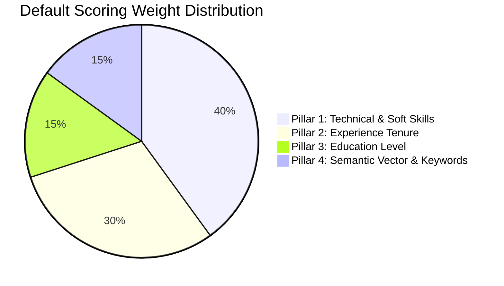
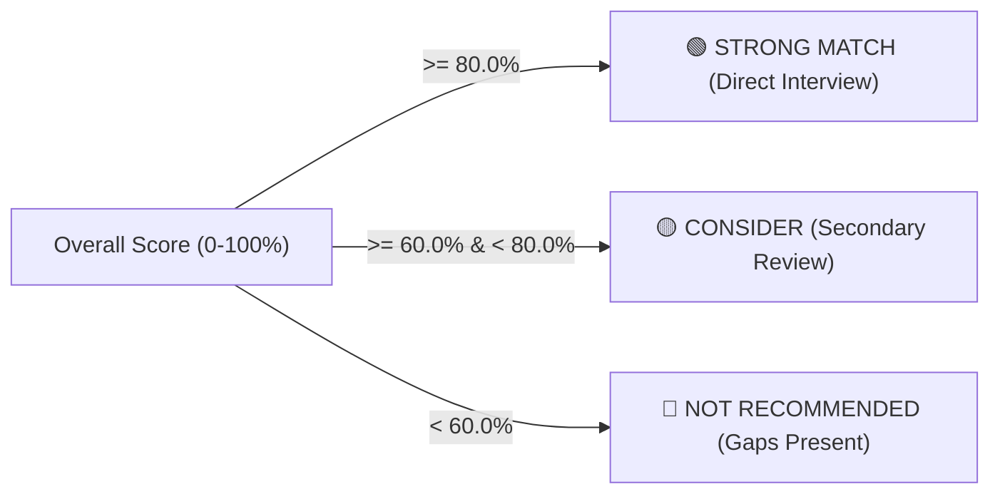

# 🎯 4-Pillar ATS Scoring Engine & Mathematical Formulation

This document details the mathematical models, weighting mechanisms, dynamic formulas, vector similarity calculations, and recommendation logic powering the ATS Scoring Engine ([`backend/scoring.py`](file:///c:/Users/hijee/Music/demo/ATS%20WITH%20AI%20EXTRACTION/backend/scoring.py)).

---

## 1. 4-Pillar Scoring Engine Overview

The ATS scores candidate suitability across 4 independent pillars, producing a normalized aggregate score between **0.0% and 100.0%**.

---

## 2. Pillar-by-Pillar Mathematical Formulation

### 2.1 Pillar 1: Technical & Soft Skills Match ($S_{\text{skill}}$)
Evaluates candidate extracted skills against role required and preferred skills using exact matching and contextual synonym resolution.

1. **Exact Matching**:
   A skill is matched if token normalized $s_{\text{req}} = s_{\text{cand}}$.
2. **Context Synonym Matching**:
   If exact match is absent, the engine scans the candidate resume text for synonyms and related technologies (e.g., `Statistical Analysis` $\leftrightarrow$ `Statistics`, `PostgreSQL` $\leftrightarrow$ `Postgres`, `React` $\leftrightarrow$ `React.js`).

$$\text{Matched Weight} = \sum_{i=1}^{M} w_i \quad (\text{where } w_i = 1.0 \text{ for matched required skills})$$
$$\text{Total Required Weight} = \sum_{j=1}^{N} w_j \quad (\text{where } N = \text{number of required skills})$$
$$S_{\text{skill}} = \min\left(1.0, \frac{\text{Matched Weight}}{\text{Total Required Weight}}\right) \times 100\%$$

* **Zero Required Skills Edge Case**: If a job role defines zero required skills, $S_{\text{skill}} = 100\%$.

---

### 2.2 Pillar 2: Experience Tenure Match ($S_{\text{exp}}$)
Evaluates candidate total years of experience against the minimum experience specified in the job role.

$$S_{\text{exp}} = \begin{cases} 
100\%, & \text{if } Y_{\text{required}} \le 0 \\
100\%, & \text{if } Y_{\text{cand}} \ge Y_{\text{required}} \\
\min\left(100\%, \max\left(0\%, \frac{Y_{\text{cand}}}{Y_{\text{required}}} \times 100\%\right)\right), & \text{if } Y_{\text{cand}} > 0 \\
0\%, & \text{if } Y_{\text{cand}} = 0
\end{cases}$$

#### Example:
* Candidate has 0.1 years (~1 month internship), role requires 2.0 years:
  $$S_{\text{exp}} = \left(\frac{0.1}{2.0}\right) \times 100\% = \mathbf{5.0\%}$$
* Candidate has 3.5 years, role requires 2.0 years:
  $$S_{\text{exp}} = \mathbf{100.0\%} \quad (+1.5\text{ yrs above requirement})$$

---

### 2.3 Pillar 3: Education Level Hierarchy Match ($S_{\text{edu}}$)
Compares the candidate's highest attained qualification rank ($R_{\text{cand}}$) against the role's required qualification rank ($R_{\text{req}}$).

| Rank | Qualification Level | Recognized Degree Keywords |
| :---: | :--- | :--- |
| **4** | Doctorate / Ph.D | `ph.d`, `doctorate`, `dr` |
| **3** | Master's Degree | `m.sc`, `m.tech`, `m.s.`, `m.e.`, `mba`, `mca`, `m.com`, `post graduate`, `pg` |
| **2** | Bachelor's Degree | `b.sc`, `b.tech`, `b.e.`, `b.s.`, `bba`, `bca`, `b.com`, `undergraduate`, `ug`, `graduate` |
| **1** | Diploma / Associate | `diploma`, `associate degree`, `polytechnic` |
| **0** | High School / Secondary | `hsc`, `sslc`, `higher secondary`, `10th`, `12th`, `matriculation` |

$$S_{\text{edu}} = \begin{cases} 
100\%, & \text{if } R_{\text{cand}} \ge R_{\text{req}} \\
70\%, & \text{if } R_{\text{cand}} = R_{\text{req}} - 1 \text{ and } R_{\text{cand}} > 0 \\
40\%, & \text{if } R_{\text{cand}} = 1\text{ (Diploma)} \text{ and } R_{\text{req}} = 2\text{ (Bachelor's)} \\
0\%, & \text{otherwise}
\end{cases}$$

---

### 2.4 Pillar 4: Semantic Vector & Domain Keywords Match ($S_{\text{sem}}$)
Combines lexical frequency analysis with dense vector embeddings to capture conceptual domain alignment.

1. **Top JD Keyword Density ($S_{\text{kw}}$)**:
   Extracts top 10 domain-specific non-stopword tokens from the Job Description and calculates hit ratio across candidate resume:
   $$S_{\text{kw}} = \frac{|\text{Matched JD Keywords}|}{|\text{Top JD Keywords}|}$$

2. **Neural Embedding Cosine Similarity ($S_{\text{emb}}$)**:
   Generates 768-dimensional sentence embeddings ($\vec{u}_{\text{resume}}, \vec{v}_{\text{jd}}$) via BAAI BGE model:
   $$\text{Cosine Similarity} = \cos(\theta) = \frac{\vec{u} \cdot \vec{v}}{\|\vec{u}\| \|\vec{v}\|}$$
   $$S_{\text{emb}} = \max(0.0, \min(1.0, \text{Cosine Similarity}))$$

3. **Blended Semantic Score ($S_{\text{sem}}$)**:
   $$S_{\text{sem}} = \left(0.50 \times S_{\text{kw}} + 0.50 \times S_{\text{emb}}\right) \times 100\%$$

---

## 3. Overall Composite Score & Custom Dynamic Weights

Recruiters can adjust pillar weights at any time via the Settings modal. The overall score is computed as:

$$W_{\text{total}} = W_{\text{skill}} + W_{\text{exp}} + W_{\text{edu}} + W_{\text{sem}}$$

$$\text{Overall Score } (S_{\text{overall}}) = \left[ S_{\text{skill}} \left(\frac{W_{\text{skill}}}{W_{\text{total}}}\right) + S_{\text{exp}} \left(\frac{W_{\text{exp}}}{W_{\text{total}}}\right) + S_{\text{edu}} \left(\frac{W_{\text{edu}}}{W_{\text{total}}}\right) + S_{\text{sem}} \left(\frac{W_{\text{sem}}}{W_{\text{total}}}\right) \right]$$

### Generated Dynamic Formula String (Example):
$$\text{Formula: } (0.40 \times 80.0\%) + (0.30 \times 5.0\%) + (0.15 \times 100.0\%) + (0.15 \times 31.8\%) = \mathbf{53.3\%}$$

---

## 4. Recommendation Classification & Actionable Insights

The engine categorizes candidates into 3 automated tiers based on $S_{\text{overall}}$:

### Actionable Gaps Generation:
The engine generates clear, numbered telemetry bullets for recruiters:
- `[1] Skills Gap`: Identifies up to 4 missing mandatory skills (e.g. `[1] Add missing required skills: Data Visualization.`).
- `[2] Experience Tenure Gap`: Reports candidate years vs required years (e.g. `[2] Candidate has ~0.1 yrs experience; role requires 2 yrs.`).
- `[3] Domain Keyword Gaps`: Highlights unrepresented JD keywords (e.g. `[3] Incorporate missing domain keywords from JD: analyze, business, dashboards.`).

