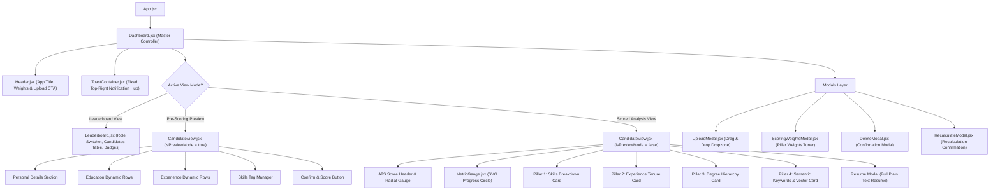

# 🖥️ Frontend Architecture, Component Hierarchy & UI Guide

This document details the frontend architecture, React 19 component tree, state management patterns, and the Neo-Brutalist enterprise UI design system.

---

## 1. Component Hierarchy & Flow



---

## 2. Directory Structure (`frontend/src/`)

```text
frontend/src/
├── App.css                    # Global Neo-Brutalist styling, tags, fonts, animations
├── App.jsx                    # Root wrapper and layout boundaries
├── index.css                  # CSS reset and utility classes
├── main.jsx                   # React 19 root DOM hydration
├── components/
│   ├── CandidateView.jsx      # Unified Pre-Scoring Preview + Scored 4-Pillar Breakdown
│   ├── Dashboard.jsx          # Primary container holding global state and lifecycle hooks
│   ├── DeleteModal.jsx        # Safe confirmation modal for candidate deletion
│   ├── Header.jsx             # Top bar containing Role Selector, Weights trigger & Upload CTA
│   ├── Icon.jsx               # Zero-dependency SVG icon catalog
│   ├── Leaderboard.jsx        # Interactive candidate table with sorting and score badges
│   ├── MetricGauge.jsx        # Custom SVG radial gauge component with dynamic colors
│   ├── PreviewEditorModal.jsx # Legacy modal (superseded by CandidateView preview mode)
│   ├── RecalculateModal.jsx   # Interactive confirmation modal for score recalculation
│   ├── ScoringWeightsModal.jsx# Sliders and numeric inputs to adjust 4-pillar weights
│   ├── ToastContainer.jsx     # High-priority top-right toast notifications
│   └── UploadModal.jsx        # Resume upload drag-and-drop interface
```

---

## 3. UI State Management Lifecycle (`Dashboard.jsx`)

1. **Role Selection (`selectedRole`)**:
   - Switching roles triggers `fetchCandidates(roleId)`, loading the respective candidate pool and scoring weights.
2. **Upload & Ingestion Pipeline**:
   - `UploadModal` sends document to `/api/candidates/extract-preview`.
   - On success, `previewCandidateData` state is set, automatically switching `Dashboard` into **Pre-Scoring Preview Mode** (`isPreviewMode = true`).
3. **Pre-Scoring Review & Edit**:
   - `CandidateView` displays all extracted candidate fields (Name, Contact, Education records, Experience records, Skills, Projects).
   - Recruiter reviews and makes corrections directly in the form.
4. **Scoring Execution**:
   - Clicking **"CONFIRM & SCORE CANDIDATE"** sends the verified payload to `/api/candidates/submit-and-score`.
   - Once scored, `previewCandidateData` is cleared, the leaderboard refreshes, and `CandidateView` transitions into the **ATS Score Breakdown View** (`isPreviewMode = false`).
   - The Candidate Details tab is hidden, presenting only the **ATS SCORE** analysis tab.

---

## 4. Top-Right Toast Notification System (`ToastContainer.jsx`)

The toast system is mounted at `position: fixed; top: 20px; right: 24px; z-index: 999999`.

### Supported Notification Types:
- `loading`: Sticky spinner banner during LLM extraction and neural embeddings computation.
- `success`: Green Neo-Brutalist card with score badges (auto-dismiss 5-7s).
- `info`: Blue notification informing user of background events or profile extractions.
- `error`: High-visibility red alert with server error details.

```javascript
// Example Toast Dispatch in React Components
addToast({
  type: 'success',
  title: 'Resume Scored Successfully!',
  message: `${candName} scored ${Number(scoredScore).toFixed(1)}% (${recommendation})`,
  badge: `Score: ${Number(scoredScore).toFixed(1)}%`,
  duration: 6500
});
```

---

## 5. Neo-Brutalist Design Tokens

The application features a high-contrast Neo-Brutalist design language tailored for enterprise productivity:

```css
/* Core Styling Rules */
.brutalist-card {
  border: 2px solid #000000;
  box-shadow: 4px 4px 0px #000000;
  background: #ffffff;
}

.brutalist-btn-yellow {
  background: #facc15;
  color: #000000;
  border: 2px solid #000000;
  box-shadow: 3px 3px 0px #000000;
  font-weight: 900;
}

.status-tag-strong {
  background: #dcfce7;
  color: #15803d;
  border: 1.5px solid #16a34a;
  box-shadow: 2px 2px 0px #16a34a;
}
```

