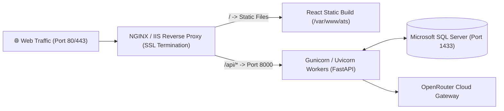

# 🛡️ Enterprise Handover, Production Deployment & Maintenance Runbook

This document serves as the official enterprise handover guide for developers, DevOps engineers, and system administrators maintaining the ATS platform in staging and production environments.

---

## 1. Enterprise Handover Checklist

When taking ownership of this codebase, verify each item in this checklist:

- [ ] **Repository Access**: Verify access to GitHub / GitLab repository and branch protection rules.
- [ ] **Database Connection**: Confirm connection to Microsoft SQL Server with database creation and DDL permissions.
- [ ] **OpenRouter API Key**: Secure an active enterprise OpenRouter API key with access to `google/gemini-2.5-flash`.
- [ ] **Environment Secrets**: Verify `.env` files are configured and NOT checked into public version control.
- [ ] **Local Build Test**: Execute `python main.py` and `npm run build` to ensure zero compilation or dependency errors.
- [ ] **Verification Upload**: Upload a test PDF resume and confirm end-to-end 4-pillar scoring.

---

## 2. Production Deployment Options

### Option A: Standard Virtual Machine (Windows Server / Linux)



#### 1. Backend Service (systemd or Windows Service)
* Run with multiple Uvicorn workers behind Gunicorn:
  ```bash
  uvicorn main:app --host 0.0.0.0 --port 8000 --workers 4
  ```

#### 2. Frontend Production Build
* Generate optimized production assets:
  ```bash
  cd frontend
  npm run build
  ```
* Serve the generated `frontend/build/` (or `dist/`) directory via NGINX or IIS.

#### 3. Sample NGINX Configuration (`/etc/nginx/sites-available/ats.conf`)
```nginx
server {
    listen 80;
    server_name ats.yourcompany.com;

    # Frontend Static Files
    location / {
        root /var/www/ats/build;
        index index.html;
        try_files $uri $uri/ /index.html;
    }

    # Backend API Reverse Proxy
    location /api/ {
        proxy_pass http://127.0.0.1:8000/api/;
        proxy_http_version 1.1;
        proxy_set_header Upgrade $http_upgrade;
        proxy_set_header Connection 'upgrade';
        proxy_set_header Host $host;
        proxy_set_header X-Real-IP $remote_addr;
        proxy_set_header X-Forwarded-For $proxy_add_x_forwarded_for;
        proxy_set_header X-Forwarded-Proto $scheme;
        client_max_body_size 25M;
    }
}
```

---

### Option B: Docker Containerization

#### Backend `Dockerfile` (`backend/Dockerfile`):
```dockerfile
FROM python:3.11-slim

# Install system dependencies & ODBC Driver 18
RUN apt-get update && apt-get install -y --no-install-recommends \
    curl \
    gnupg \
    unixodbc-dev \
    gcc \
    g++ \
    && curl https://packages.microsoft.com/keys/microsoft.asc | apt-key add - \
    && curl https://packages.microsoft.com/config/debian/11/prod.list > /etc/apt/sources.list.d/mssql-release.list \
    && apt-get update \
    && ACCEPT_EULA=Y apt-get install -y msodbcsql18 \
    && rm -rf /var/lib/apt/lists/*

WORKDIR /app
COPY requirements.txt .
RUN pip install --no-cache-dir -r requirements.txt

COPY . .
EXPOSE 8000
CMD ["uvicorn", "main:app", "--host", "0.0.0.0", "--port", "8000", "--workers", "4"]
```

#### Frontend `Dockerfile` (`frontend/Dockerfile`):
```dockerfile
# Stage 1: Build
FROM node:20-alpine AS build
WORKDIR /app
COPY package*.json ./
RUN npm ci
COPY . .
RUN npm run build

# Stage 2: NGINX Serve
FROM nginx:alpine
COPY --from=build /app/build /usr/share/nginx/html
EXPOSE 80
CMD ["nginx", "-g", "daemon off;"]
```

---

## 3. Security & Compliance Standards

1. **SQL Injection Prevention**:
   - Every database query across [`database.py`](file:///c:/Users/hijee/Music/demo/ATS%20WITH%20AI%20EXTRACTION/backend/database.py) and all route handlers uses parameterized binding (`cursor.execute(query, params)`). No dynamic raw string concatenation is permitted.
2. **API Secret Masking**:
   - `OPENROUTER_API_KEY` is loaded exclusively from environment variables and never logged or returned in health check endpoints.
3. **Data Protection & PII Retention**:
   - Candidates can be permanently removed from the system using the `DELETE /api/candidates/{id}` endpoint, which cascades deletions across `ScoringResults`, `CandidateEditedDetails`, and `CandidateEmbeddings`.

---

## 4. Performance Tuning & Scaling

| Layer | Optimization Strategy |
| :--- | :--- |
| **Database** | Connection pooling via `Database.get_connection()` with automatic cursor cleanup in `finally` blocks. |
| **Embeddings** | Vector caching in `JDEmbeddings` and `CandidateEmbeddings` prevents redundant API calls for identical documents. |
| **Scoring** | Vector dot products and cosine similarities executed using vectorized NumPy operations. |
| **Frontend** | Sub-second client-side filtering and sorting; modals and preview tabs render on-demand. |

---

## 5. Maintenance Runbook

### 5.1 Adding a New Job Role with Custom Skills
1. Insert into `JobRoles`:
   ```sql
   INSERT INTO JobRoles (RoleName, Description, MinExperience, EducationRequirements)
   VALUES ('Cloud Architect', 'Design cloud solutions on AWS/Azure', 5, 'Bachelor in Computer Science');
   ```
2. Map required skills in `RoleSkills`:
   ```sql
   INSERT INTO RoleSkills (RoleID, SkillID, IsRequired, Weight)
   VALUES (@NewRoleID, @AWSSkillID, 1, 1.0);
   ```

### 5.2 Resetting / Recalculating All Scores
To recompute scores for all candidates across all roles without calling the LLM:
```bash
curl -X POST "http://localhost:8000/api/candidates/recalculate-all"
```

### 5.3 Database Backup & Restore
* **Backup**:
  ```sql
  BACKUP DATABASE [ATSSystem] TO DISK = 'C:\Backups\ATSSystem.bak' WITH FORMAT, MEDIANAME = 'ATS_Backup';
  ```
* **Restore**:
  ```sql
  RESTORE DATABASE [ATSSystem] FROM DISK = 'C:\Backups\ATSSystem.bak';
  ```

